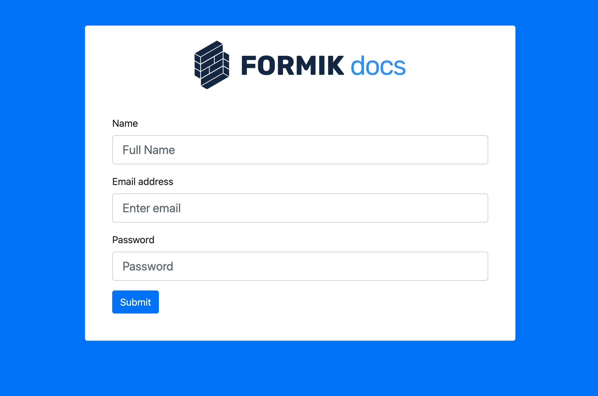

  

## Workshop 4Geeks Academy - Formik - -Yup - Reactjs

## Ejercicio

- Crearemos un formulario como el de la imagen usando bootstrap

- Los campos será validados utilizando yup

- Simularemos el llamado a una api

